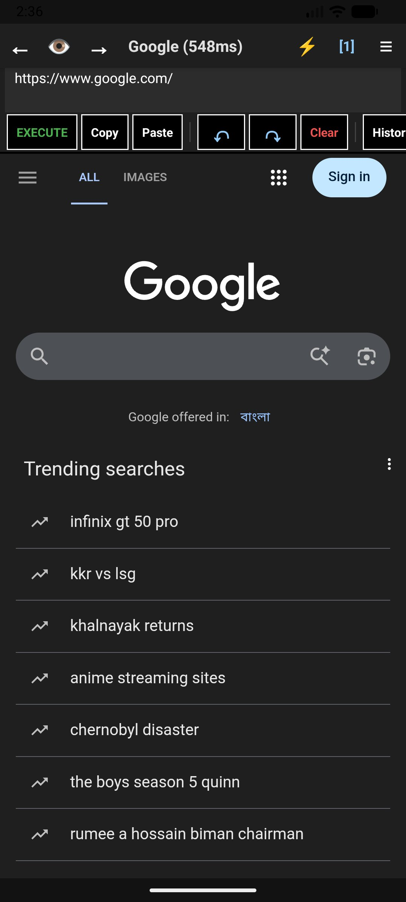
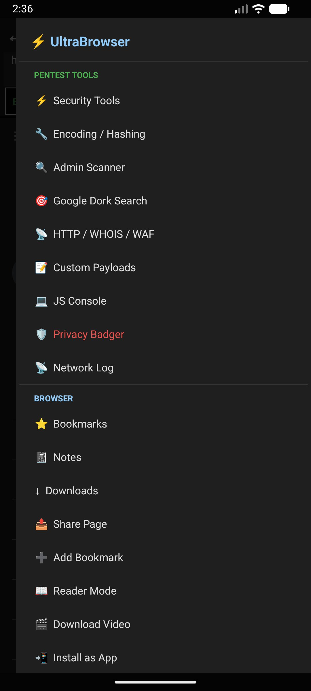
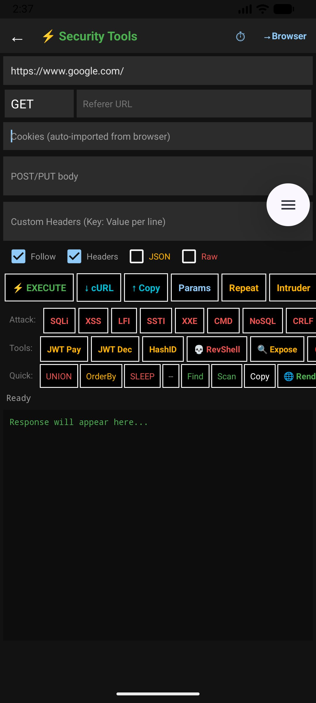
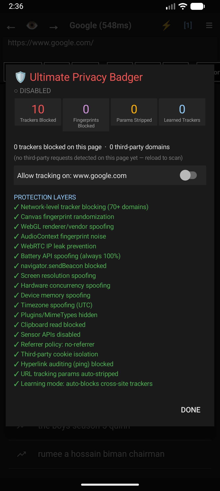
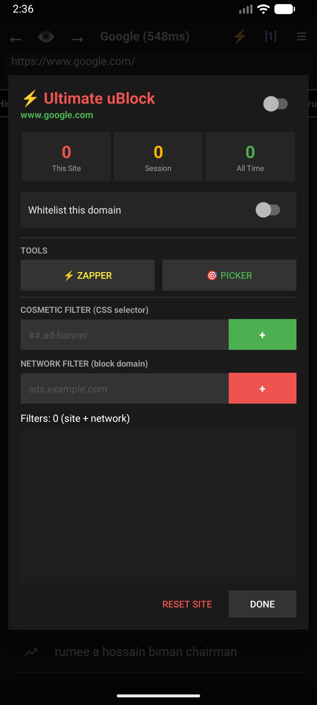

# ⚡ UltraBrowser

### Privacy Browser + Security Toolkit for Android

**Browse privately. Test securely. All in one app.**

A privacy-first Android browser with a built-in ethical security testing toolkit — designed for security researchers, penetration testers, and privacy-conscious users.

---

## 🔍 What is UltraBrowser?

UltraBrowser combines a **full-featured privacy browser** with an **integrated security testing toolkit** in a single app. No switching between apps, no data leaking between tools, no separate setups.

- 🌐 **Browse** — Fast, tab-based browsing with built-in ad blocking and tracker protection
- 🛡️ **Protect** — 19-layer fingerprint spoofing, WebRTC leak prevention, and automatic URL parameter stripping
- 🔧 **Test** — SQL injection, XSS, SSTI, and 10+ other payload categories for authorized security testing

> **⚠️ The security testing toolkit is for authorized, ethical use only.** A legal disclaimer (citing CFAA, UK CMA, EU Directive 2013/40) must be accepted before accessing any testing tools.

---

## 📱 Screenshots

<table>
<tr>
<td align="center"> <b>Browser</b> Fast browsing with load timer</td>
<td align="center"> <b>Main Menu</b> Pentest tools + browser features</td>
<td align="center"> <b>Security Tools</b> Full HTTP client + payload library</td>
</tr>
<tr>
<td align="center"> <b>Privacy Badger</b> 19-layer anti-fingerprinting</td>
<td align="center"> <b>uBlock Engine</b> Ad blocking + custom filters</td>
<td align="center"></td>
</tr>
</table>

---

## ✨ Browser Features

### 🌐 Core

- **Multi-Tab System** — Chrome-style tabs with page previews, favicons, and persistent state across app restarts
- **Incognito Mode** — True private browsing: no history, no cache, no disk persistence, cookie isolation, 🕶 visual indicator
- **Reader Mode** — Distraction-free article reading with automatic content extraction and clean typography
- **Desktop Mode** — 12+ User-Agent presets with live UA fetching and custom UA support
- **Picture-in-Picture** — Auto-PiP for fullscreen video with floating download button
- **Find in Page** — Real-time search with next/previous navigation
- **Install as App** — PWA support: fetches manifest.json, downloads icons, creates home screen shortcuts
- **Full-Page Screenshot** — Scrolling capture that triggers lazy-loaded content for complete page shots
- **Video Downloader** — Detects direct MP4/WebM sources, og:video meta tags, and embedded video URLs
- **Download Engine** — Background downloads with cookie pass-through, MIME detection, and referer headers
- **Cookie Editor** — Floating draggable button with full per-domain cookie CRUD
- **JS Console** — Toggle-able inline console hooking log, warn, error, and info with color coding
- **View Source** — Searchable HTML source viewer
- **Edit Mode** — Toggle `contentEditable` on any page for inline DOM editing

---

## 🛡️ Privacy Engine — *Ultimate Privacy Badger*

A 6-layer anti-tracking and anti-fingerprinting system inspired by EFF's Privacy Badger:

| Layer | Protection | Details |
|:-----:|-----------|---------|
| **1** | **Tracker Blocking** | 160+ known tracker domains blocked at the network level |
| **2** | **URL Param Stripping** | 77 tracking parameters automatically removed |
| **3** | **Fingerprint Spoofing** | Canvas noise · WebGL spoofing · AudioContext noise · Screen/Hardware/Timezone spoofing |
| **4** | **Cookie Isolation** | Third-party cross-domain cookie writes blocked |
| **5** | **Referrer Policy** | Enforces `no-referrer` on all pages |
| **6** | **Learning Mode** | Auto-detects and blocks trackers seen on 3+ websites |

**Additional protections:**

| Protection | Description |
|-----------|-------------|
| 🔇 WebRTC Leak Prevention | STUN/TURN server removal |
| 🔋 Battery API Spoofing | Always reports 100% charged |
| 📡 sendBeacon Blocked | Prevents tracking pings |
| 📋 Clipboard Protection | Read/write sniffing blocked |
| 🎯 Sensor API Disabled | Gyroscope/accelerometer fingerprinting prevented |
| 🔗 Hyperlink Auditing | `<a ping>` stripped with MutationObserver |
| 📍 Location Spoofing | Custom GPS coordinates with toggle (off by default) |
| 🔐 HTTPS-Everywhere | Automatic HTTP → HTTPS upgrade |
| 🚫 HTTPS-Only Mode | Blocks all insecure HTTP connections |
| 🕵️ Identity Spoofing | 19-layer navigator/platform/brand override |
| ⚡ uBlock Engine | Cosmetic + network ad blocking with custom filters |

---

## 🔧 Security Toolkit — *Security Tools*

> All tools require first-launch authorization consent. For authorized penetration testing only.

### Injection Testing — 800+ Pre-built Payloads

| Category | Description |
|----------|----------|
| **SQL Injection** | MySQL Union · Error-Based · Blind (Boolean + Time) · MSSQL · PostgreSQL · WAF Bypass · Auth Bypass |
| **XSS** | Basic · WAF Bypass · DOM-based · Polyglot |
| **SSTI** | Jinja2 · Twig · Freemarker · Mako · Pebble · Velocity · Smarty |
| **XXE** | Basic · SSRF chain · File Read · OOB Exfiltration · Parameter Entity |
| **Command Injection** | Linux + Windows variants |
| **LFI / RFI / SSRF** | Path traversal · PHP wrappers · Remote inclusion |
| **NoSQL Injection** | MongoDB · CouchDB |
| **CRLF Injection** | Header injection · Response splitting |
| **Open Redirect** | Protocol-relative · Data URI · JS schemes |
| **Deserialization** | Java · PHP · Python · .NET gadget chains |
| **HTTP Smuggling** | CL.TE · TE.CL · TE.TE |
| **JWT Attacks** | Algorithm confusion · None bypass · kid injection |

### Reconnaissance & Analysis

| Tool | Description |
|------|-------------|
| **Admin Scanner** | 80+ common admin/config paths with HTTP HEAD probing |
| **Google Dork Search** | 8 categories — SQLi targets, admin panels, sensitive files, WordPress, exposed services, cameras |
| **Exposure Scanner** | Multi-threaded (20 threads) vulnerability surface scanner |
| **Parameter Fuzzer** | 15-thread concurrent parameter discovery |
| **Header Analyzer** | HTTP response header inspection + port scanning |
| **HTTP History** | Burp Suite-style request log (500-entry circular buffer, in-memory) |
| **Hash Identifier** | Auto-detects MD5, SHA-1/256/512, bcrypt, NTLM, Argon2 + hashcat mode numbers |
| **JWT Decoder** | Header/payload decode, algorithm analysis, vulnerability detection |
| **JWT Generator** | Custom JWT creation with configurable claims |
| **Reverse Shell Gen** | Templates: Bash, Python, Perl, PHP, Ruby, Netcat, OpenSSL, Java, PowerShell |
| **Encoding / Hashing** | URL encode/decode, Base64, HTML entities, MD5, SHA hashing |
| **Custom Payloads** | Personal payload clipboard — save, organize, tap to inject |

---

## 🔐 Privacy by Design

| Principle | Implementation |
|-----------|---------------|
| **Zero data collection** | No analytics, no telemetry, no crash reporting to external servers |
| **No account required** | No sign-up, no login, no cloud sync |
| **Local-only storage** | All data stored on-device — bookmarks, notes, history, settings |
| **No ads** | No ad SDK, no ad network, no tracking |
| **Incognito isolation** | Private tabs never touch disk — no history, no cache, no previews |
| **HTTP History in-memory** | Network request logs cleared on app close |
| **Security Tools gated** | Legal disclaimer required before first access |

---

## 📋 Requirements

- **Android 5.0** (Lollipop) or higher
- **~15 MB** installed size
- No special permissions required on Android 13+

---

## 📄 Changelog

### v1.6.0 (Current)
- 🔧 Fixed critical bug: tabs, history & bookmarks resetting on every launch
- 🔧 Fixed bookmark and note deletion not working
- 🔧 Fixed incognito tabs leaking history and breaking normal tab cookies
- 🛡️ Privacy Badger: learning mode now persists across restarts, fingerprint counter active
- 🖥️ JS Console rewrite: toggle, close button, color-coded log/warn/error/info
- ⬇️ Video downloader: blob URL filtering, cookie pass-through, MIME detection
- 📍 Location spoofing now off by default with proper enable/disable toggle
- 📱 Edge-to-edge display support for Android 15+
- 🔄 Predictive back gesture support
- ⚡ Picture-in-Picture for fullscreen video

<b>v1.5.0</b>

- Initial Play Store release
- 20 activities, full security toolkit
- Privacy Badger with 6-layer anti-tracking
- uBlock engine with custom filters
- Multi-tab system with preview persistence

---

## 🐛 Bug Reports & Feature Requests

Found a bug or have a feature idea? [Open an issue](../../issues) with:

- **Bug reports:** Device model, Android version, steps to reproduce, expected vs actual behavior
- **Feature requests:** Clear description of the feature and why it would be useful

---

## ❓ FAQ

<b>Can it download YouTube/Instagram videos?</b>

No. YouTube, Instagram, Twitter, and similar platforms use encrypted adaptive streaming (DASH/HLS with DRM). The video downloader works on sites that serve direct MP4/WebM files — news sites, educational platforms, file hosting, and self-hosted video.

<b>Is the source code available?</b>

No. UltraBrowser is a proprietary, closed-source application. This repository serves as the official project page for releases, documentation, and issue tracking.

<b>Is this legal to use?</b>

The browser itself is fully legal. The security testing tools are designed for authorized, defensive, white-hat operations. You must have explicit permission to test any system you do not own. The app requires acceptance of a legal disclaimer before accessing Security Tools.

<b>Does UltraBrowser collect any data?</b>

No. Zero analytics, zero telemetry, zero crash reporting. All data stays on your device. There is no cloud sync, no account system, and no external server communication beyond the websites you choose to visit.

<b>Why does it need foreground service permission?</b>

For background file downloads only. Uses Android's `shortService` type with a 3-minute limit — the minimum required to complete a download while the app is in the background.

---

## 👤 Developer

**Sharodshahi Al-Amin**
[@savaskarofficial](https://github.com/savaskarofficial) · Undercover IT Firm

---

## 📜 License

Copyright © 2025 Sharodshahi Al-Amin. All rights reserved.

UltraBrowser is proprietary software. Unauthorized copying, modification, distribution, or reverse engineering is strictly prohibited.

---

**Built with ☕ and paranoia.**

*Privacy is not optional. Security is not a crime.*

⚡

